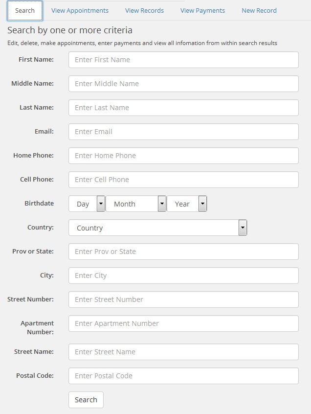

THIS IS THE FREEWARE VERSION OF DELTA APPOINTMENTS WORDPRESS PLUGIN

This is the first working version. Changes are being made on a continuous basis with regard to
file names, functions, code optimization etc.

Licensed under GPL http://www.gnu.org/licenses/gpl.html

1. Description
This is an appointment management plugin. It creates database tables where it stores personal data of your clients such as name, birth date, email, telephone numbers, address, appointment and payments. It is run on the administrator side of Wordpress i.e. dashboard. When you install the plugin you will see a Delta Appointments icon on the left hand side.

The plugin has a tabbed view i.e. search tab, records tab, appointments tab, payments tab, new record tab. The plugin can be used to keep personal, appointment, payment records for your clients or for your own personal use.

2. File Structure
ed-da-delta-appointments.php is the main Controller, it creates dashboard representation for the plugin. It communicates with controller.js by sending/receiving data and uses this data to send/receive data to/from models.php

controller.js is the Javascript controller responsible for dynamically displaying HTML data, collecting HTML data and sending/receiving it to/from ed-da-delta-appointments.php.

helpers.js and validation.js are auxiliary files for controller.js

models.php is the Model file that communicates with ed-da-delta-appointments.php to send/receive/retrieve database data. 

helpers-model.php is the auxiliary file for models.php

views.php is the View file responsible for static generation of HTML views.

helpers-views.php is the auxiliary file for views.php

3. Cross Referencing
This is how various pieces of code are cross-referenced, ideally and in theory. Any function will have a number matching the code line number indicated in the preceding comments e.g. 77. A reference to a number is made using the file name, the function name and the number e.g. models.php #223. The function name should be used whenever possible. In jQuery this is bit problematic as it could be something like jQuery( document ).on( "click", "#buttonAddCustomer", function() - since they are anonymous functions. Here is the id name could be used instead of the function name.

Note that the reference number can and will change depending on the alterations made to the code, and hopefully they will be not too far from each other i.e. the code line number and the reference number. Whenever a mismatch noticed, an update is necessary.

A sample comment featuring its own reference number and the numbers in other files.
// #77
// Add new customer/record. Receives data from delta-appointments-plugin.js #16
// and calls models.php::insertCustomerAddressTable #223
// to insert a new row in customerDetails table

4. Screenshot
-----------

